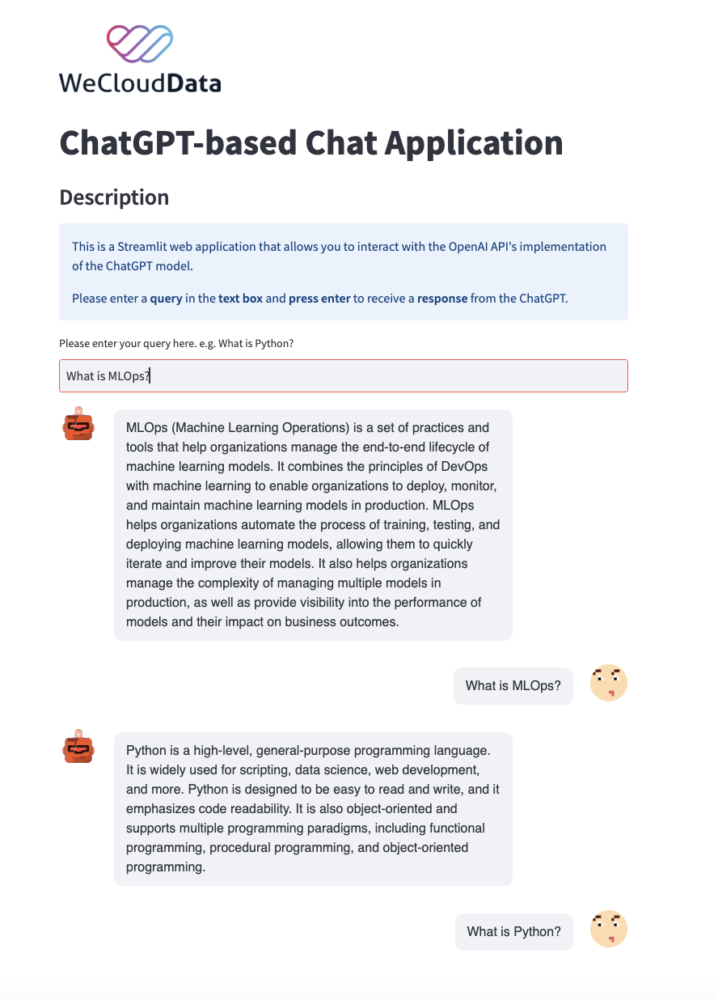

# ChatGPT-based Chat Application

## Description
This web application utilizes Streamlit and the OpenAI API to create an interactive chat interface that allows users to engage in a conversation with the ChatGPT model.

## Features
- Streamlit-based user interface
- Text input for user queries
- Display of chat conversation
- Utilizes OpenAI API for ChatGPT responses

## Demo
 

## How to Use
1. Install required dependencies:
```bash
pip install -r requirements.txt
```

2. Set up an OpenAI API key by following the instructions:
    1. Go to https://platform.openai.com/account/api-keys
    2. Create or log in to an account
    3. Click on "Create new secret key"
    4. Copy the secret key

3. Create a hidden directory named streamlit and then create a file named secrets.toml inside that directory.
```bash
mkdir .streamlit
touch .streamlit/secrets.toml
```

4. Inside secrets.toml put your Open API Key
```python
OPENAI_API_KEY = "YOUR_OPENAI_API_KEY"  
```

5. Run the Streamlit application in the terminal.
```bash
streamlit run app.py
```

6. Access the application through the provided URL.
7. Type your query in the text box and press Enter.
8. The ChatGPT model will provide a response which will be displayed on the screen along with the chat history.

## Deployment to Streamlit
- Follow this guide to deploy an app: https://docs.streamlit.io/streamlit-community-cloud/get-started/deploy-an-app
- Follow this guide for secret management: https://docs.streamlit.io/streamlit-community-cloud/get-started/deploy-an-app/connect-to-data-sources/secrets-management

## Implementation Details
The application is built using Streamlit for the user interface and OpenAI's GPT-3 based ChatGPT model for generating responses.

- The `get_user_query()` function collects user input from a text box.
- The `call_openai_chat_gpt()` function sends the user query to the OpenAI API, receives the ChatGPT response, and returns the generated text.
- The `main()` function manages the interaction between user input and ChatGPT responses, as well as rendering the chat history.